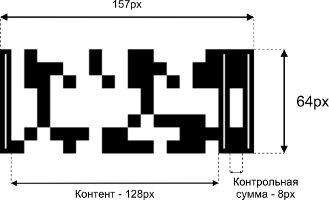
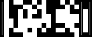
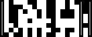

# C. Идентификация котиков (40 баллов)

Сильный и независимый программист Вася держит дома 12 котов. Коты ходят гулять на улицу, и Вася хочет следить за тем, как каждый из них уходит и возвращается. Для этого Вася установил над дверцей для котов веб-камеру, которая делает фото, когда кот входит и выходит. Чтобы автоматически различать котов между собой, Вася придумал напечатать на их ошейниках баркоды, для отрисовки которых он придумал собственный алгоритм.

Помогите Васе написать функцию, которая отрисовывает баркод для ошейников его котов.

## Формат информации о коте

Вася хранит информацию о котах в виде объектов:  

```typescript
type CatInfo = {  
    /**  
     * Кличка кота -  строка из маленьких и больших  
     * латинских букв и цифр, и пробелов (от 0 до 11 символов)  
     */  
    name: string;  
    /**  
     * Идентификатор кота - целое число от 0 до 255  
     */  
    id: number;  
    /**  
     *  Дата родждения кота в формате UNIX timestamp  
     */  
    birthday: number;  
}
```

## Алгоритм отрисовки баркода
Баркоды, которые придумал Вася, выглядят так:



В баркоде две основные секции: контент и контрольная сумма, ограниченные прямоугольниками шириной 7 пикселей с толщиной границы 3 пикселя.

Контент представляет собой 8 строк по 16 черных или белых квадратов в каждой строке (размер одного квадрата 8 на 8 пикселей), строки заполняются последовательно сверху вниз. Контрольная сумма — это столбец из 8 квадратов.

Белые квадраты в контенте кодируют 0, чёрные — 1.

### Алгоритм формирования контента баркода

Поле *name* дополняется пробелами в конце до 11 символов и конвертируется в байтовый массив — каждому символу строки ставится соответствующий ASCII-код (число от 0 до 255).

Каждый элемент полученного массива переводится в двоичную запись (восемь сивмолов 0 или 1) и кодируется последовательностью из восьми квадратов (0 — белый квардрат, 1 — чёрный квадрат). Квадраты отрисовываются в контенте баркода последовательно и построчно.

Далее поле *id* конвертируется в 8-битное двоичное число, которое кодируется последовательностью из восьми квадратов и дописывается в контент баркода.

Затем поле *birthday* переводится в 32-битное двоичное число, которое по такому же принципу кодируется квадратами и дописывается в конец баркода.

### Алгоритм формирования контрольной суммы

Контрольная сумма вычисляется по строкам контента. Для отрисовки квадрата контрольной суммы определяется чётность суммы значений контента в соответствующей строке. Если значение чётное — в строке рисуется белый квадрат, в противном случае — чёрный.

## Формат решения

Загружаемое вами решение должно содержать функцию renderBarcode:

```javascript
/**  
 * Отрисовать баркод для кота  
 * @param catInfo {CatInfo} - информация о коте  
 * @param element {HTMLDivElement} - div с фиксированным размером 157x64 пикселей,  
 *     в который будет отрисовываться баркод  
 */  
function renderBarcode(catInfo, element) {  
    // ваш код  
}
```

Решение будет запускаться в браузере Google Chrome 77.

## Примеры работы

Информация о коте:
```javascript
{  
    "id": 185,  
    "name": "Murzick",  
    "birthday": 1164210686  
}
```
Баркод:



***

Информация о коте:
```javascript
{  
    "id": 96,  
    "name": "Ferdinand",  
    "birthday": 1429648740  
}
```
Баркод:

